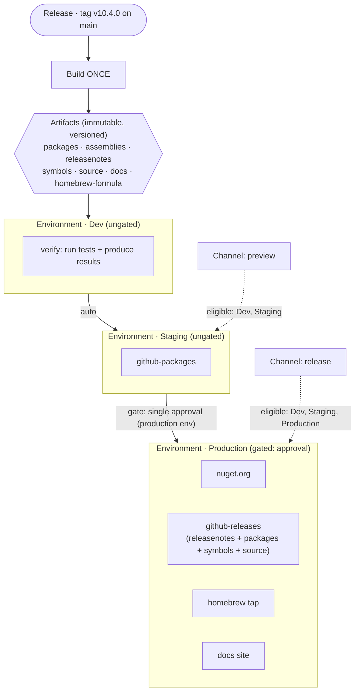

# ADR-0009 — Continuous delivery model: releases, channels, environments, targets, deployments

- **Status:** Proposed
- **Date:** 2026-07-17
- **Deciders:** Fallout maintainers
- **Builds on:** [ADR-0001](0001-cd-primitives-attributes-vs-tasks.md) (CD *mechanism* — attributes vs tasks vs hybrid). **Complements, does not supersede.**
- **Relates to:** RFC [#106](https://github.com/Fallout-build/Fallout/issues/106) (CD platform vision), RFC [#113](https://github.com/Fallout-build/Fallout/issues/113) (deployment agent), epic [#332](https://github.com/Fallout-build/Fallout/issues/332) (CD model), issue [#334](https://github.com/Fallout-build/Fallout/issues/334) (`ReleaseChannel` / `DeploymentTarget`), [ADR-0004](0004-calendar-versioning-and-dual-pace-channels.md) / [ADR-0008](0008-collapse-experimental-into-main.md) (versioning + channels).

## Context

ADR-0001 answered *how* Fallout talks to a CD system: config that is file-shaped uses the `[Attribute] → writer` pattern (as CI does), state that lives in an external database uses `*Tasks → REST`, and stable external config uses the hybrid `[Attribute] + Sync` target. That is the **mechanism** layer, and it stands.

What it did **not** define is the **domain model** — the vocabulary a Fallout build reasons in when it releases software: what a *release* is, how *channels* gate reach, what an *environment* and a *target* are and how they differ, and what a *deployment* records. Today the only concrete piece is `Fallout.Components.PublishTarget` — a sealed, **NuGet-feed-shaped** class (`Source` = a v3 index) consumed by `IPublish.Publish`, which hardcodes `DotNetNuGetPush`. It cannot express a GitHub Release, a Homebrew tap, or a documentation site, and it has no notion of promotion, gating, or deployment history. The `FALLOUT001` registry row says as much: *"Promote by deleting the attribute once `ReleaseChannel` / `DeploymentTarget` (#334) settle."* This ADR settles them.

Fallout is unusual as a CD *subject*: it is a library/CLI that others consume as packages, so **the package feed is simultaneously the artifact store and the deployment destination**. There is no long-running server to deploy onto; "deploying" means publishing built artifacts to a registry. The model below is shaped for that reality while staying general enough for the server-deploy case ADR-0001 sketched (Octopus, the RFC #113 agent).

### The mental model (Octopus, adapted)

- **Release** — an immutable snapshot of the code: a `v*` **tag**. The version is derived from it. A release is built **once**.
- **Artifact** — what the build produces *from* a release: `packages` (`.nupkg`), `assemblies`, `releasenotes`, `symbols`, `source`, `documentation`, `homebrew-formula`. Immutable and versioned.
- **Target** — a distribution *endpoint* that accepts certain artifact kinds: `nuget.org`, `github-packages`, `github-releases`, `homebrew`, `docs`. Implements `IPublishTarget`.
- **Environment** — a promotion **stage** (`Dev` → `Staging` → `Production`) that **groups** targets and carries a gate. This matches the dev-world/Octopus reading ("Production is an environment; `prod-db-01` is a target within it").
- **Channel** — which environments a release is *eligible* for. `preview` → {Dev, Staging}; `release` → {Dev, Staging, Production}.
- **Deployment** — one (artifact → target) push, tracked and retryable.

## Decision

### D1 — The promotion invariant (the consistency lynchpin)

> **A release is built once; that single immutable artifact promotes through its channel's eligible environments in order, gated between stages. Promotion never crosses channels — a `preview` artifact is never re-versioned into a `release` artifact.**

This is what makes "build once" and "promote through Dev→Staging→Prod" both true at the same time. NuGet package identity is immutable (the version is embedded in the bits), so you *cannot* promote `X-preview.5` into `X` — you would rebuild, which is a different release. So maturity (`preview`/`rc`/GA) is fixed **at build time by the channel**; environments only control **distribution reach**, not version. Within one `release`-channel run the identical `.nupkg` set flows Dev→Staging→Prod, so the bits on `github-packages` equal the bits on `nuget.org` — exactly the reproducibility guarantee a package publisher needs.

### D2 — Two layers: domain model vs GitHub realization

The domain model (D1's vocabulary) is provider-neutral. GitHub Actions is one **realization** of it, and the two are bridged by Fallout's generator (the same way `[GitHubActions]` already generates workflow YAML):

| Domain concept | GitHub Actions realization |
|---|---|
| Release | git tag (+ the GitHub Release object) |
| Artifact | Actions artifact / release asset |
| **Environment (stage)** | *(see D3)* |
| **Target (endpoint)** | a GitHub **Environment** — gives a per-target **Deployment** record |
| Deployment | a GitHub Deployment (emitted by a job's `environment:`) |
| Channel | the version string + which trigger fires |

GitHub Environments are flat (no nesting), so a Fallout **Environment** (stage, a *group* of targets) does not map 1:1 to a GitHub Environment. That is the source of the "is env a stage or a target?" confusion, and D3 resolves it.

### D3 — Environments group targets; the GitHub realization is per-target envs + a stage gate

- **Domain:** `Production` is an environment that *contains* the targets `nuget.org`, `github-releases`, `homebrew`, `docs`.
- **GitHub realization (chosen):** each **target** is its own GitHub Environment (`nuget`, `github-releases`, `homebrew`, `docs`, `github-packages`) — this is what produces a granular per-target **Deployment** record, and it matches what the repo does today. The **stage gate** ("enter Production") is realized as **one `production` GitHub Environment carrying the required-reviewer rule, on a lightweight gate job** that the Production target jobs `needs:`. Staging targets are ungated; `preview` is ungated end-to-end.

This gives all three properties at once: granular per-target deployment tracking, a single approval to promote to Production, and a faithful stage→targets grouping. Deployment granularity is **(artifact-kind × target)** — one record per publish arm — **not** per individual `.nupkg` (22 packages × N targets would be deployment noise; the release is the atomic unit).

### D4 — `IPublishTarget` (this is #334's `DeploymentTarget`)

Generalize the NuGet-feed-shaped `PublishTarget` into an interface with per-provider implementations (extends the existing `FALLOUT001` publish surface; new CD types are gated `FALLOUT005`):

```csharp
public enum ArtifactKind { Packages, Assemblies, ReleaseNotes, Symbols, SourceArchive, Documentation, HomebrewFormula }

public sealed record Artifact(ArtifactKind Kind, string Version, IReadOnlyList<AbsolutePath> Files);

public interface IPublishTarget
{
    string Name { get; }                                              // "nuget.org", "github-packages", "homebrew"
    bool Accepts(Artifact artifact);                                  // which artifact kinds this endpoint takes
    Task DeployAsync(IReadOnlyList<Artifact> artifacts, DeploymentContext context);
}

public sealed record Channel(string Name, IReadOnlyList<string> Environments);          // preview→[Dev,Staging]; release→[Dev,Staging,Production]
public sealed record DeploymentEnvironment(string Name, int Order, bool RequiresApproval, IReadOnlyList<IPublishTarget> Targets);
```

- `PublishTarget` becomes the **NuGet-feed implementation** (`Source`, `ApiKey`, include/exclude routing, `SkipDuplicate` — unchanged), and `IPublish.PublishTargets` returns `IEnumerable<IPublishTarget>`. `github-packages` and `nuget.org` are two instances of it.
- `github-releases` (creating the Release + attaching `releasenotes` / `packages` / `symbols` / `source`), `homebrew`, and `docs` are further implementations. Per ADR-0001, `github-releases` and `homebrew` are built on `*Tasks → REST` (`GitHubReleaseTasks` is already sketched there); a target's `DeployAsync` is the seam that calls them.
- A target may declare `Accepts` for **several** artifact kinds (`github-releases` takes release notes *and* packages *and* symbols).

### D5 — A target may belong to more than one environment

`github-packages` is a member of **both** `Staging` (canary / pre-release push) **and** `Production` (the GA feed) — re-pushing the same version is a no-op via `SkipDuplicate`, so this is safe. `github-releases` is `Production`-only, with an *optional* pre-release variant in `Staging` (GitHub marks the Release `prerelease: true`). Environments own a *set* of targets; targets are not exclusive to one stage.

### D6 — Cross-repo targets start in-pipeline, evolve to downstream-owned

`docs` (Docusaurus) and `homebrew` (a tap) live in **other repositories**, so drift is the risk. Modelling each as a first-class `IPublishTarget` is the mitigation: the release pipeline is the **single source of truth**, those repos are *written to* by the release (version-pinned), never hand-maintained, and each push is a **tracked, retryable deployment** — a failed docs/tap update shows red on its environment exactly like a failed nuget push. **First cut:** the deploy runs *in-pipeline* (direct cross-repo push). **Evolution:** the downstream repo owns its own publish, triggered by `repository_dispatch` from the release — an implementation swap behind `IPublishTarget`, no model change.

### D7 — Workflow shape: reusable workflows named `{action}-{artifact}-{target}`

Build once, deploy many. A release-pipeline workflow packs once, uploads the artifact, then calls **reusable workflows** (`workflow_call`), one per `{artifact}-{target}` arm — each bound to its target's GitHub Environment (so each is a tracked deployment) and each downloading the shared artifact (so the bits are identical everywhere):

- `publish-packages-github`, `publish-packages-nuget`, `publish-releasenotes-github`, `publish-formula-homebrew`, `publish-docs-github`.
- Produce/verify actions (no target) stay `{action}-{artifact}`: `test`, `build-assemblies`, `pack-packages`. The three-token pattern governs the **delivery** family only.

Fallout already generates CI YAML from `[GitHubActions]`; generating this fan-out — **and the promotion diagram below** — from the `Channel`/`DeploymentEnvironment`/`IPublishTarget` config is the natural next capability.

### D8 — Fallout's own line is green-fielded off `main`

The first consumer is Fallout's own `v10.4` bridge release, cut from `main`, modelled exactly this way; all future releases follow. The version-scheme reconciliation (`v10.4` vs the `2026.x` CalVer in `version.json` / ADR-0004) is a **separate maintainer decision** and does not gate this model — the model is version-scheme-agnostic.

## The diagram



A `preview` release stops at Staging (`github-packages` gets `X-preview.N`); a `release` release promotes the identical GA `X` bits through to Production's targets after one approval.

## Consequences

### Positive

- **One coherent vocabulary** (release / channel / environment / target / deployment) that maps cleanly onto both a package publisher (feeds-as-targets) and the server-deploy case ADR-0001 sketched.
- **Reproducibility by construction** — D1 guarantees the bits on every target within a release are identical.
- **`IPublishTarget` unblocks promoting `FALLOUT001`** — settles the `DeploymentTarget` half of #334; providers slot in without touching the build kernel.
- **Deployment history for free** — per-target GitHub Environments emit Deployment records; cross-repo targets get the same retry/visibility as feed pushes (D6), which is the multi-repo drift mitigation.

### Negative

- **Two layers to hold in your head** (domain model vs GitHub realization). Mitigated by the generator being the only place the mapping lives.
- **Per-target GitHub Environments proliferate** (one per target) plus a `production` gate env. Accepted for the granular tracking; the gate env keeps approvals to one click.
- **`IPublishTarget` is a breaking change to the `FALLOUT001` experimental surface** (`PublishTargets` return type changes `PublishTarget` → `IPublishTarget`). Acceptable under the experimental contract; adding/removing `[Experimental]` is not a breaking change and the surface was explicitly flagged as unstable pending #334.

### Neutral

- ADR-0001 (mechanism) and ADR-0004/0008 (versioning + channels) are unchanged. This ADR adds the model *on top* of ADR-0001 and reuses ADR-0004/0008's `preview`/`rc`/GA maturity as the `Channel` axis.

## Alternatives considered

### A. Environments model maturity tiers, promote the artifact across them (rejected in this form)

An earlier framing made `github-packages`="staging" and `nuget.org`="production" as tiers you promote a *version* through. **Rejected** because it implies promoting `-preview` bits into GA bits, which NuGet immutability forbids. D1 keeps the tiers but scopes promotion to *within a single channel's build* (same bits, different reach), which is consistent.

### B. Per-package deployment records

Track every `.nupkg × target` as its own deployment. **Rejected** — 22 packages × N targets is deployment noise, and the release is the atomic unit. Granularity is (artifact-kind × target).

### C. Independent per-target workflow files (no shared build)

Each `publish-*-*` as a standalone workflow. **Rejected** — either each rebuilds (breaks D1's identical-bits guarantee) or shares an artifact awkwardly across runs. Reusable workflows called by one build-once orchestrator (D7) give the named arms without losing immutability.

### D. Keep `PublishTarget` NuGet-only, add separate mechanisms for releases/homebrew

Leave the feed model alone and bolt on ad-hoc targets. **Rejected** — it forgoes the single `IPublishTarget` seam, so every new destination reinvents routing/gating/tracking. The interface is the point.

## References

- [ADR-0001 — CD primitives: attributes for config, tasks for state](0001-cd-primitives-attributes-vs-tasks.md) (mechanism; complemented here)
- [ADR-0004](0004-calendar-versioning-and-dual-pace-channels.md) / [ADR-0008](0008-collapse-experimental-into-main.md) — versioning + `preview`/`rc`/GA channels
- RFC [#106](https://github.com/Fallout-build/Fallout/issues/106), RFC [#113](https://github.com/Fallout-build/Fallout/issues/113), epic [#332](https://github.com/Fallout-build/Fallout/issues/332), issue [#334](https://github.com/Fallout-build/Fallout/issues/334)
- Existing surface: `src/Fallout.Components/IPublish.cs`, `src/Fallout.Components/PublishTarget.cs`
- [docs/experimental-apis.md](../experimental-apis.md) — `FALLOUT001` (publish surface), `FALLOUT005` (CD model, allocated here)
