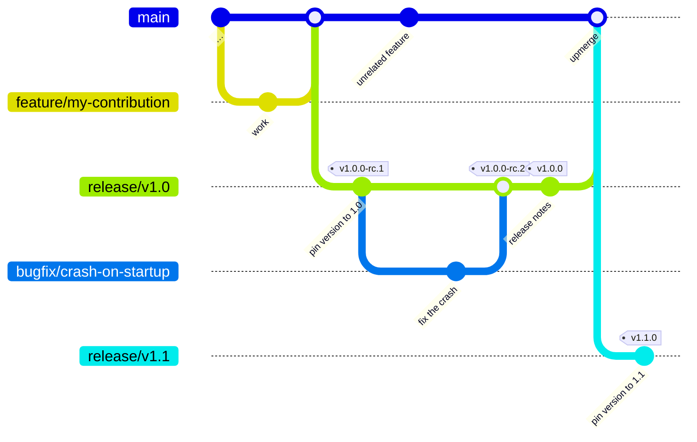
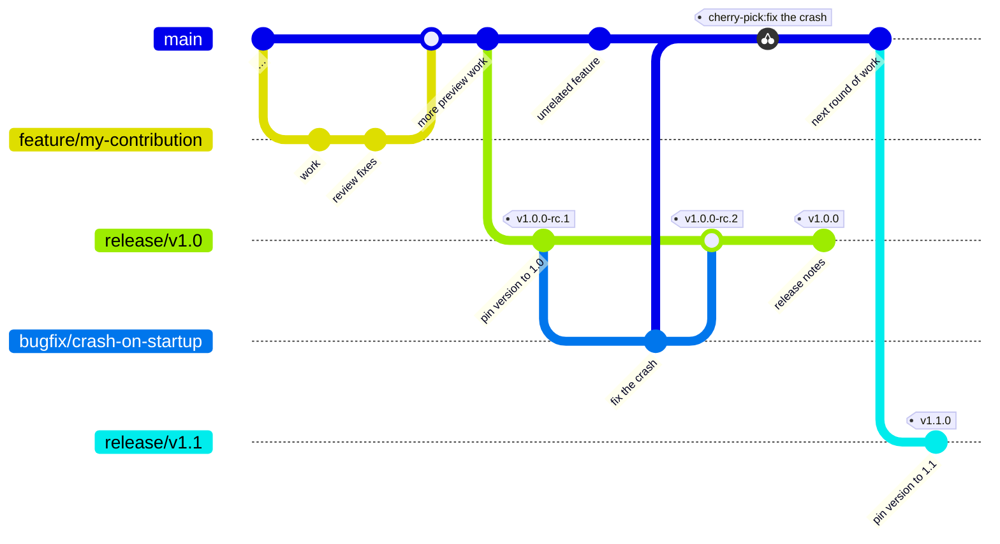

# Branching and release flow

We aim to follow [Gitlab Flow](https://about.gitlab.com/topics/version-control/what-is-gitlab-flow/), a lightweight Gitflow alternative.
What does that mean for you as a contributor or maintainer of this project?

## How to contribute code

1. You develop on a local fork
2. You raise a PR once your work is ready for review
3. Target `main` on the Fallout-Upstream
4. Your code gets merged

Every push to `main` triggers a pre-release on Github, including publishing nuget packages to Github (but not Nuget.org!).
This is a cheap way to get our hands on pre-release packages without the cost of publishing anything to official Package Repositories.

## How to publish a new release

Sometimes it becomes necessary to create a stabilisation branch to make sure we iron out the worst bugs before pushing a release.
For this purpose Gitlab Flow allows us to create branches, i.e. `release/v1.0`
> [!NOTE]
> While a release branch exists, it becomes necessary to raise some PRs against `release/v1.0` and **then** upmerge those changes against `main` as well

> [!INFO]
> Please make sure to follow our naming pattern for release branches

TODO: Create a documnent describing our naming patterns etc. in detail. Can probably sit with AI instructions.

### Upmerge (Preferred)

### Cherry Picking

### Support and Retirement of old release/v* branches

We use the `release/v1.0` branch after the release to be able to provide support, i.e. hotfixes to the release but otherwise it stays stagnant. This branch keeps living on until we decided to cut the next release `v1.1` and successfully published it through its branch `release/v1.1`. **THEN** we can delete the old release branch `release/v1.0` and cease support for this release.
Since we're an open source project and work with git tags, people on an older release can always go back in time, branch off an old version and apply their own hotfixes. We are happy to accept those as a PR, re-open the old release branch and publish another hotfix release **if** and **when** we see the need.

> [!WARNING]
> The release branch `release/v1.0` stays alive but stagnant, `main` moves forward. Once we cut release `v1.1` we introduce branch `release/v1.1` and the previous release branch `release/v1.0` can retire

Once we feel comfortable with our release, we can `git tag` our release with the appropiate version, which triggers [`publish-packages-release.yml`](../.github/workflows/publish-packages-release.yml) to run the publish release pipeline.

## References

- [CONTRIBUTING.md](../CONTRIBUTING.md)
- [docs/agents/release-and-versioning.md](agents/release-and-versioning.md)

- TODO: Mermaid diagram showing the branches and maybe a few examples of how to merge
- TODO: cli commands examples for release candidate and actual release
