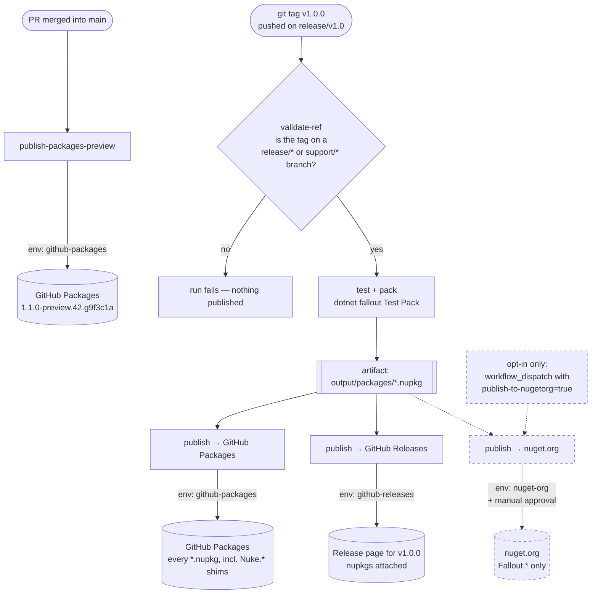
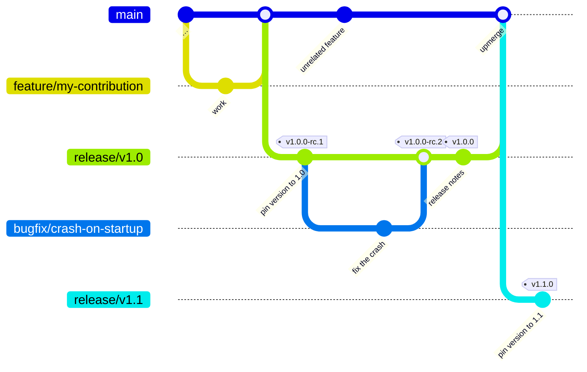
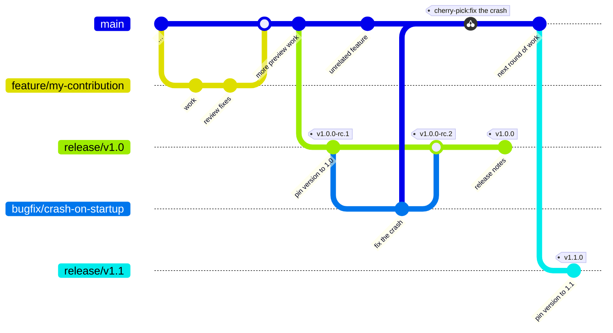
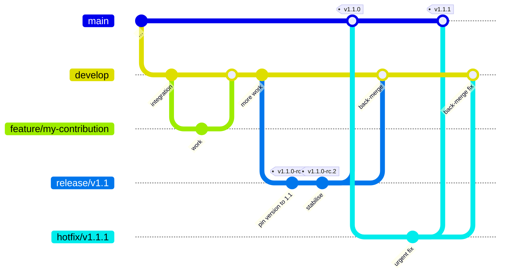

# Branching and release flow

What does branching mean for you as a contributor or maintainer of this project?

> [!NOTE]
> This document has two halves. **Current state** describes what we do *today* — it is kept true, and if it drifts from the repository that's a bug. **North Star** describes where we intend to go next; nothing in it is implemented yet.

---

# Current state

We run a **trunk-based** model: `main` is both the integration trunk and the preview lane, with production lines cut off it on demand.

## Lines live right now

Keep this block current — the examples further down use these values.

| Line | Branch | Ships | Latest |
|---|---|---|---|
| Preview | `main` | `10.5.0-preview.<height>.g<sha>` → GitHub Packages, per commit | rolling |
| Production | `release/v10.4` | `10.4.0` → GitHub Packages + GH Release; nuget.org opt-in | `v10.4.0` |
| Legacy | `support/v10` | `10.3.x` security/critical only | `10.3.47` |

`main` is deliberately **not** in `publicReleaseRefSpec`, which is why its previews carry the `.g<sha>` suffix — they're non-public builds by design. Production lines are listed there, so their packages are clean.

A Docker-based local NuGet server is available for pre-merge testing via `tests/integration/docker-compose.yml`.

## How to contribute code

1. You develop on a local fork
2. You raise a PR once your work is ready for review
3. Target `main` on the Fallout upstream
4. Your code gets merged

Every push to `main` triggers a pre-release on GitHub, including publishing NuGet packages to GitHub Packages (but **not** nuget.org). This is a cheap way to get our hands on pre-release packages without the cost of publishing anything to official package repositories.

Merges are **rebase-only**. Plain merge commits are disabled by repo setting; **squash is still enabled at the repo level**, so on release branches the convention — not the setting — is what keeps squashes out. Squashing a promotion would collapse it into one opaque commit, defeating the point of promoting reviewed commits verbatim. Curate your commits before final approval.

## How to publish a new release

Sometimes it becomes necessary to create a stabilisation branch to make sure we iron out the worst bugs before pushing a release. For this purpose we create a release branch, i.e. `release/v1.0`.

> [!NOTE]
> While a release branch exists, it becomes necessary to raise some PRs against `release/v1.0` and **then** upmerge those changes against `main` as well.

Branch and tag naming patterns are in [versioning.md](versioning.md#branch-naming-patterns). The short version: production lines are `release/v<major>.<minor>`, legacy maintenance is `support/v<major>`, and tags carry a `v` prefix so the `v*` protection ruleset applies.



### Upmerge (Preferred)



### Cherry Picking



### Support and Retirement of old release/v* branches

We use the `release/v1.0` branch after the release to be able to provide support, i.e. hotfixes to the release, but otherwise it stays stagnant. This branch keeps living on until we decide to cut the next release `v1.1` and successfully publish it through its branch `release/v1.1`. **THEN** we can delete the old release branch `release/v1.0` and cease support for this release.

Since we're an open source project and work with git tags, people on an older release can always go back in time, branch off an old version and apply their own hotfixes. We are happy to accept those as a PR, re-open the old release branch and publish another hotfix release **if** and **when** we see the need.

> [!WARNING]
> The release branch `release/v1.0` stays alive but stagnant, `main` moves forward. Once we cut release `v1.1` we introduce branch `release/v1.1` and the previous release branch `release/v1.0` can retire.

One line is exempt: **`support/v10` is a long-lived legacy maintenance branch**, not a stagnant release branch. It takes security and critical fixes only, and it does not retire when a newer line is cut.

Once we feel comfortable with our release, we can `git tag` our release with the appropriate version, which triggers [`publish-packages-release.yml`](../.github/workflows/publish-packages-release.yml) to run the publish release pipeline.

### Commands, end to end

The exact sequence — cutting the line, pinning the candidate, rolling `main` forward, tagging, and opting into nuget.org — is in [versioning.md → Cutting the next line](versioning.md#cutting-the-next-line). It lives there because every step is a version-number decision, and splitting it across two documents is how the two drift apart.

Two things worth knowing before you start:

- **Roll `main`'s preview core forward in the same sitting as the cut.** Skip it and the preview lane strands below the release you just shipped.
- **nuget.org never publishes from a tag push.** It needs `workflow_dispatch` with `publish-to-nugetorg=true`, and then still clears an environment approval.

### If a publish fails partway through

Every `dotnet nuget push` uses `--skip-duplicate`, so re-running a publish job is idempotent on packages that already made it. For a transient failure mid-publish, re-run against the existing tag:

```bash
# Routine re-run — leave publish-to-nugetorg false
gh workflow run publish-packages-release.yml --ref release/v10.4 -f tag=v10.4.0

# Stabilised re-run — include the flag to retry the nuget.org push
gh workflow run publish-packages-release.yml --ref release/v10.4 -f tag=v10.4.0 -f publish-to-nugetorg=true
```

## What's protected

`main`, every release line, and every `support/*` branch share the same profile: required `ubuntu-latest` status check, linear history, CODEOWNER review (0 additional approvals), no direct pushes, no force-push or deletion, conversation resolution required, admins able to bypass in emergencies. Stale approvals are **not** dismissed when new commits land (`dismiss_stale_reviews: false`).

How it's applied differs by branch:

- **Release lines** — covered by the pattern-based ruleset on `refs/heads/release/**` ([19766406](https://github.com/Fallout-build/Fallout/rules/19766406)), so protection attaches automatically at branch creation. Payload committed at `.github/release-branch-ruleset.json`. **Nothing to apply by hand.**
- **`main` and `support/*`** — classic per-branch protection, configured individually.

`v*` tags are a separate ruleset ([17017817](https://github.com/Fallout-build/Fallout/rules/17017817)) covering creation, deletion and update, bypassable by repo admins only.

For the promotion and hotfix flows (promoting `main → release/v*`, forward-porting a stable-urgent fix, and deprecating a `support/*` line), see the upmerge and cherry-pick diagrams above.

---

# North Star

Not implemented. Recorded so the gap stays visible rather than being rediscovered each time.

## GitFlow

We aim to move to **[GitFlow](https://nvie.com/posts/a-successful-git-branching-model/)** proper, including a long-lived `develop` branch.



| | Current | North Star |
|---|---|---|
| Integration trunk | `main` | `develop` |
| Preview lane publishes from | `main` | `develop` |
| `main` holds | trunk + previews | **released code only**, tagged at each GA |
| Stabilisation | `release/v*` cut from `main` | `release/v*` cut from `develop` |
| Urgent fixes | `hotfix/*` off a support line | `hotfix/*` off `main`, back-merged to `develop` |
| Feature branches | off `main` | off `develop` |

## Calendar versioning

Production lines become `release/YYYY`, retired years become `support/YYYY`, and breaking changes batch to the yearly cut. See [versioning.md → North Star](versioning.md#north-star) and [ADR-0004](adr/0004-calendar-versioning-and-dual-pace-channels.md).

## The two have to land together

Under GitFlow the preview lane moves to `develop`, which means `version.json`'s `{height}` core and `publicReleaseRefSpec`'s exclusion both move with it. Sequencing CalVer and GitFlow separately means migrating the same fields twice.

> [!CAUTION]
> **Adopting `develop` reopens a question we already answered once.** [ADR-0008](adr/0008-collapse-experimental-into-main.md) removed the `experimental` branch precisely because a second long-lived lane drifted ~17 commits *behind* `main` and carried no unique work — the forward-port discipline never happened. A `develop` branch takes on that same obligation in the opposite direction. Adopting GitFlow means saying explicitly what will make the back-merge stick this time, and superseding ADR-0008 rather than quietly contradicting it.

## References

- [versioning.md](versioning.md) — where version numbers come from, and the two traps that have bitten us
- [CONTRIBUTING.md](../CONTRIBUTING.md)
- [docs/agents/release-and-versioning.md](agents/release-and-versioning.md)
- [ADR-0012](adr/0012-current-state-semver-10x-north-star-calver-gitflow.md) — current state vs North Star, and why
